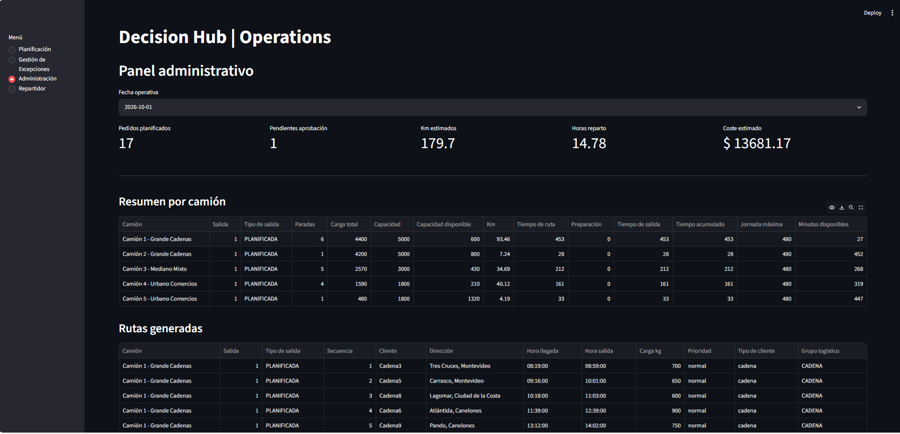
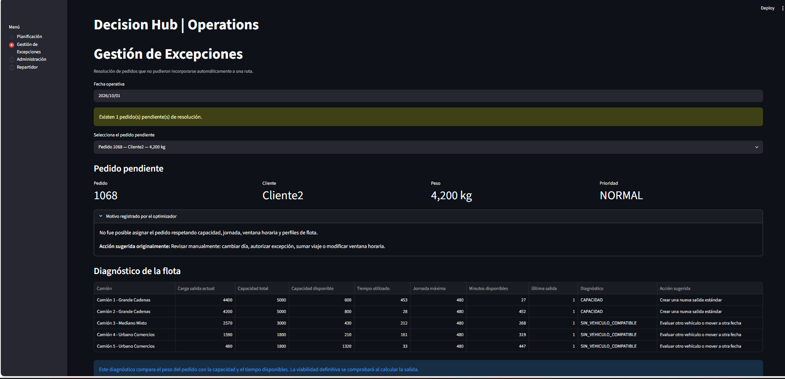
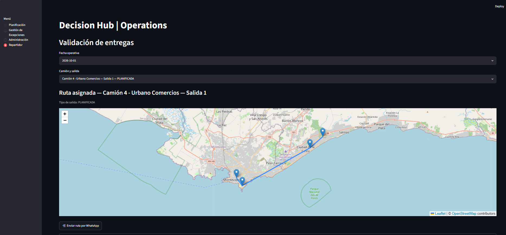
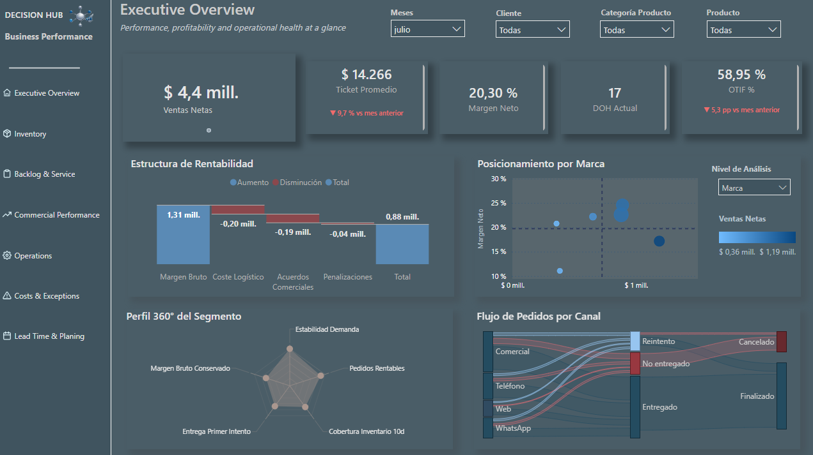
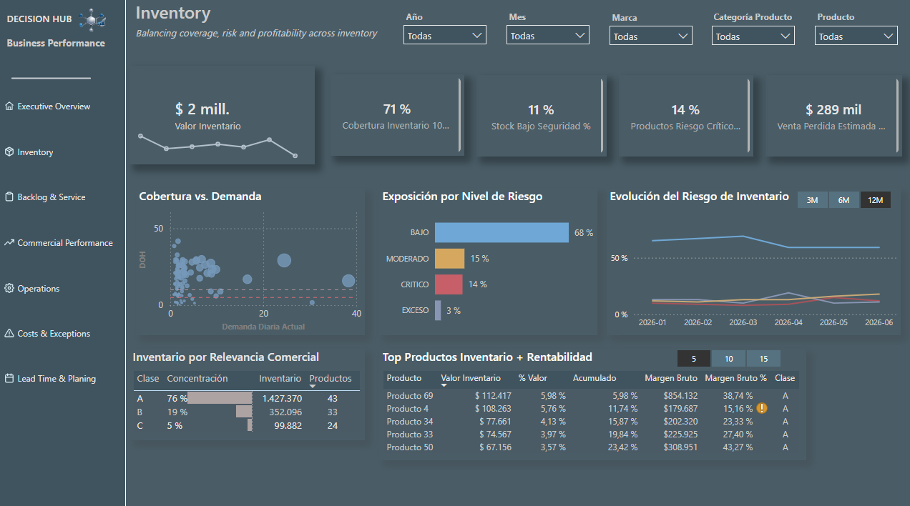

# Decision Hub – Business Performance

**English** | [Español](README_ES.md)

## Project Vision

**Decision Hub – Business Performance** is an MVP of an integrated decision-support platform that connects operational, commercial, and management data within a single environment.

The project combines process automation, operational optimization, data persistence, and Business Intelligence to transform day-to-day activity into actionable information for different levels of the organization.

The current MVP uses a distribution and commercial activity scenario as a demonstration environment, while its architecture is designed to evolve into a broader corporate model by incorporating additional business areas, data sources, and business rules.

> The objective is not only to visualize what happened, but to connect data, operations, and analytics to support decisions about what to do next.

---

## An Integrated Approach

Decision Hub is structured around two complementary layers that share a common data foundation:

### Operational Layer — Decision Hub | Operations

Developed primarily with **Python, PostgreSQL, Streamlit, and Google OR-Tools**, this layer supports the management and analysis of key distribution operations.

Implemented capabilities include:

- preparation and validation of eligible orders;
- order classification based on operational rules;
- order and vehicle assignment;
- route optimization using Google OR-Tools;
- management of vehicle capacities and operational constraints;
- identification and diagnosis of unassigned orders;
- management of exceptions and additional trips;
- order rescheduling;
- incident recording and tracking;
- estimation of distances, travel times, and operating costs;
- geographic route visualization;
- generation of route information for drivers;
- route sharing via WhatsApp for mobile access;
- persistence of planning results in PostgreSQL.

### Analytical Layer — Business Performance & Management Analytics

The **Power BI** layer extends the operational view by connecting logistics activity with commercial, inventory, cost, service, and profitability indicators.

Its purpose is to provide different levels of analysis within the same environment, ranging from operational monitoring for managers to an executive view of overall business performance.

The model supports indicators related to areas such as:

- inventory and coverage;
- sales;
- margin and costs;
- OTIF and operational performance;
- incidents and rescheduling;
- inventory risk;
- products and customers;
- business concentration and performance trends;
- operational and commercial exposure.

This approach prevents operations from being analyzed in isolation: operational results can be connected to their commercial, economic, and service impact.

---

## Project in Action

The following views illustrate how Decision Hub connects operational decision-making with business analytics within the same environment.

### Operational Workflow — Decision Hub | Operations

The Streamlit application supports the operational workflow from planning and exception management to route execution.

#### Operations Overview



Operational planning overview with key indicators, fleet utilization, estimated distance, operating time, cost, and generated routes.

#### Exception Management



Diagnostic view for orders that could not be assigned under the configured operational constraints, supporting exception analysis and subsequent action.

#### Route Execution



Driver-oriented view with geographic visualization of the route and assigned stops, route sharing via WhatsApp for mobile access, and recording of delivery outcomes. The driver can confirm each order as delivered, rejected, or not delivered, providing a reason when applicable.

### Business Performance Analytics — Power BI

The analytical layer complements operational planning with management and executive analysis. The current Power BI implementation includes two developed pages: **Executive Overview** and **Inventory**.

#### Executive Overview



Interactive executive view of sales, profitability, inventory coverage, and service performance, including month-over-month comparisons and multidimensional business analysis.

#### Inventory Analysis



Inventory decision-support view combining inventory value, coverage, critical risk, estimated lost sales, risk evolution, commercial relevance, and product profitability.

---


## Solution Architecture

```text
                     DECISION HUB
                  Business Performance
                          │
          ┌───────────────┴───────────────┐
          │                               │
   OPERATIONAL LAYER                ANALYTICAL LAYER
          │                               │
 Python / Streamlit                    Power BI
 Google OR-Tools                          │
 Folium / OpenStreetMap                   │
          │                               │
          └──────────── PostgreSQL ───────┘
                          │
              Operational & commercial data
                          │
                          ▼
                   DECISION SUPPORT
```

PostgreSQL acts as the central data layer, connecting operational processes with the analytical model.

The project currently uses the following schemas:

```text
analytics
comercial
logistica
```

This separation keeps operational, commercial, and analytical structures distinct while preserving the ability to connect them when required.

---

## Operational Flow

At a high level, the planning process follows this workflow:

```text
Orders
   ↓
Validation
   ↓
Classification
   ↓
Optimization preparation
   ↓
Fleet assignment
   ↓
Google OR-Tools
   ↓
Routes & planning
   ↓
Exceptions / incidents / rescheduling
   ↓
PostgreSQL persistence
   ↓
Streamlit + Power BI
   ↓
Decision-support information
```

The Streamlit application acts as the operational interface, while Power BI provides a complementary management analytics and monitoring layer.

---

## Route Optimization and Distance Calculation

The optimization engine uses **Google OR-Tools** to solve assignment and planning problems while considering the constraints configured in the model.

In the current demonstration environment, distance matrices are calculated using the **Haversine formula**, while travel times are estimated using a configurable average speed.

This separation between the optimization engine and the distance source allows the matrix to be replaced in a future implementation by routing services based on road networks and traffic data without redesigning the core optimization logic.

Routes are geographically represented using **Folium and OpenStreetMap**.

---

## Cost Model

The MVP incorporates a configurable cost model to estimate the economic impact of operational planning, including concepts such as:

- vehicle-related cost;
- distance travelled;
- operator/driver hourly cost;
- operating time;
- number of stops;
- additional trips.

Working-time cost is calculated using a configurable hourly operator cost. The model is designed to distinguish between regular working hours and, once the corresponding logic is activated, apply an additional factor to overtime hours.

When an additional trip is performed by the same vehicle during the same working day, the model considers the associated variable costs and additional preparation time without duplicating the vehicle's fixed cost.

The values currently used are demonstration parameters and do not represent audited corporate costs.

In a production implementation, these parameters could be sourced from finance, fleet management, human resources, fuel, maintenance, and other corporate systems.

---

## Synthetic Data and Demonstration Environment

The project uses synthetic data to provide a controlled environment in which the architecture, operational rules, optimization processes, and analytical model can be validated without relying on confidential corporate information.

The `comercial` module generates synthetic commercial activity and supports scenarios involving customers, products, orders, inventory, forecasts, promotions, and costs, connecting them with logistics operations.

Synthetic data makes it possible to demonstrate how the model works. The incorporation of real corporate data would broaden the analytical scope, introduce additional operational scenarios, and improve the accuracy of the parameters used.

---

## Repository Structure

```text
.
├── comercial/
│   ├── __init__.py
│   ├── seed_comercial.py
│   └── seed_decision_hub.py
│
├── decision_hub/
│   ├── __init__.py
│   ├── app.py
│   ├── app_db.py
│   ├── clasificador_pedidos.py
│   ├── gestion_incidencias.py
│   ├── matriz_distancias.py
│   ├── optimizador.py
│   ├── or_tools_engine.py
│   ├── parametros.py
│   ├── persistencia.py
│   ├── repositorio.py
│   ├── seed_clientes.py
│   ├── seed_flota.py
│   ├── seed_pedidos.py
│   └── validacion_pedidos.py
│
├── .env.example
├── .gitignore
├── requirements.txt
├── README.md
└── README_ES.md
```

### Main Components

`decision_hub/app.py`  
Streamlit interface and operational planning orchestration.

`decision_hub/or_tools_engine.py`  
Optimization engine based on Google OR-Tools.

`decision_hub/optimizador.py`  
Preparation and coordination of the optimization process, assignments, and exceptions.

`decision_hub/repositorio.py`  
Access to operational data stored in PostgreSQL.

`decision_hub/persistencia.py`  
Persistence of routes and planning results.

`decision_hub/gestion_incidencias.py`  
Recording and management of operational incidents.

`decision_hub/matriz_distancias.py`  
Construction of distance and travel-time matrices.

`comercial/`  
Generation and integration of synthetic data for the commercial and analytical layers.

---

## Technologies

**Backend & Processing:** Python, Pandas, NumPy, SQLAlchemy  
**Database:** PostgreSQL  
**Optimization:** Google OR-Tools  
**Operational Application:** Streamlit  
**Mapping:** Folium + OpenStreetMap  
**Business Intelligence:** Microsoft Power BI  
**Configuration:** environment variables managed with `python-dotenv`

---

## Local Setup

### 1. Create a virtual environment

```bash
python -m venv .venv
```

### 2. Activate it

On Windows:

```powershell
.\.venv\Scripts\Activate.ps1
```

### 3. Install dependencies

```bash
pip install -r requirements.txt
```

### 4. Configure PostgreSQL

Copy:

```text
.env.example
```

as:

```text
.env
```

and complete the credentials for the local environment.

The `.env` file is excluded from the repository and must not be included in version control.

### 5. Run the application

```bash
streamlit run decision_hub/app.py
```

---

## Scalability

Decision Hub is designed around a modular architecture.

The current MVP demonstrates the integration of operations, logistics, commercial activity, inventory, costs, and management analytics. The same approach can progressively be extended to other corporate areas through additional data sources, models, and business rules.

Potential future developments include:

- integration with ERP and other corporate systems;
- GPS and fleet positioning;
- road-network-based distance and travel-time matrices;
- traffic information;
- integration of validated corporate costs;
- additional functional areas and data sources;
- further process automation;
- predictive models for demand, incidents, travel times, and costs;
- expanded executive indicators and decision scenarios.

The objective of this evolution is not to turn each business area into an independent application, but to maintain an **integrated view of the business** that connects operational decisions with their commercial, economic, and service impact.

---

## Project Status

**Demonstration MVP under development.**

The functional architecture and decision model are designed to evolve into a solution connected to corporate systems as the project moves toward a production environment.

Current functionalities and parameters should be interpreted within the demonstration context of the project.

---
